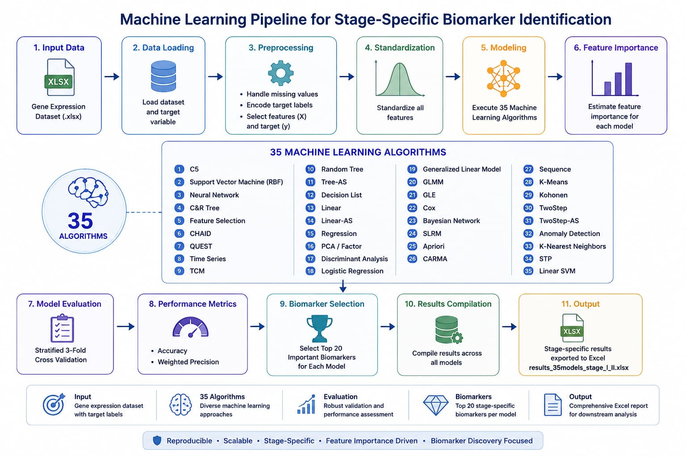

<a id="readme-top"></a>

<div align="center">

# Machine Learning Pipeline Documentation


<br>

<b>Stage-Specific Biomarker Identification Using 35 Machine Learning Algorithms</b>

</div>

<br>

<div align="center">



</div>

---

<div align="center">

## 

</div>

<div align="center">

| Component | Version |
|:---:|:---:|
| **Python** | **3.13** |
| **Operating System** | **Windows 10 / Windows 11** |
| **Development Environment** | **Jupyter Notebook / Visual Studio Code** |

</div>

---

<div align="center">

## 

</div>

<div align="center">

| Package | Purpose |
|:---:|:---:|
| **pandas** | Data loading and preprocessing |
| **numpy** | Numerical computation |
| **scikit-learn** | Machine learning models and evaluation |
| **scipy** | Scientific computing |
| **openpyxl** | Excel file support |
| **xgboost** | Gradient boosting algorithms |
| **imbalanced-learn** | Imbalanced dataset utilities |
| **tensorflow** | Deep learning backend |

</div>

<div align="center">

### Installation

```bash
pip install pandas numpy scikit-learn scipy openpyxl xgboost imbalanced-learn tensorflow
```

</div>

---

<div align="center">

## 

</div>

<div align="center">

### Input

Gene expression dataset (`.xlsx`)

Target variable: `target`

### Output

Accuracy scores for all 35 machine learning algorithms

Weighted precision scores

Top 20 biomarkers identified by each algorithm

Normalized feature importance scores

Stage-specific biomarker evaluation

Structured Excel results for downstream analysis

### Output File

`results_35models_stage_specific.xlsx`

</div>

---

<div align="center">

## 

</div>

<div align="center">

The pipeline evaluates **35 machine learning algorithms** for classification performance and feature-level biomarker identification.

For each applicable model, the pipeline estimates feature importance, evaluates predictive performance using stratified cross-validation, ranks the most important features, and records the corresponding performance metrics.

The resulting output provides a structured comparison of model performance and candidate biomarkers.

</div>

---

<div align="center">

## 

</div>

<div align="center">

### Procedure: `LOAD_DATA`

</div>

```text
Procedure LOAD_DATA(Path, Target_Column)

    Read Excel dataset

    IF Target_Column exists in dataset THEN

        X ← all predictor variables
        y ← Target_Column

    ELSE

        X ← all columns except the last column
        y ← last column

    END IF

    IF y contains categorical labels THEN

        Encode categorical labels into integer values

    END IF

    Feature_Names ← names of predictor variables

    Return X, y, Feature_Names

End Procedure
```

<div align="center">

The procedure separates predictor variables from the target variable and converts categorical target labels into numerical values when required.

</div>

---

<div align="center">

## 

</div>

<div align="center">

### Procedure: `FEATURE_IMPORTANCE`

</div>

```text
Procedure FEATURE_IMPORTANCE(Model, X, y)

    Fit Model using X and y

    IF Model provides linear coefficients THEN

        Importance ← absolute value of model coefficients

        IF coefficients contain multiple classes THEN

            Importance ← mean coefficient magnitude across classes

        END IF

    ELSE IF Model provides inherent feature importance THEN

        Importance ← model feature_importances_

    ELSE

        Baseline_Accuracy ← Accuracy(Model predictions on X)

        FOR each feature j in X DO

            X_Permuted ← copy of X

            Randomly shuffle values of feature j

            Permuted_Accuracy ← Accuracy(Model predictions on X_Permuted)

            Importance[j] ←
                Baseline_Accuracy − Permuted_Accuracy

        END FOR

    END IF

    Return Importance

End Procedure
```

<div align="center">

Feature importance is obtained according to the capabilities of each model. Models with accessible coefficients or inherent tree-based importance values use those measures directly. Models without an intrinsic importance measure use permutation-based importance.

</div>

---

<div align="center">

## 

</div>

<div align="center">

### Procedure: `EVALUATE_MODEL`

</div>

```text
Procedure EVALUATE_MODEL(Model, X, y)

    Create Stratified 3-Fold Cross-Validation

        Number_of_Folds ← 3
        Shuffle ← True
        Random_State ← 42

    Generate cross-validated predictions

    Accuracy ← Accuracy Score(
        y,
        cross_validated_predictions
    )

    Precision ← Weighted Precision Score(
        y,
        cross_validated_predictions
    )

    Return Accuracy, Precision

End Procedure
```

<div align="center">

Model performance is evaluated using stratified three-fold cross-validation. Accuracy and weighted precision are calculated from the cross-validated predictions.

</div>

---

<div align="center">

## 

</div>

<div align="center">

### Model Set

</div>

```text
Models ← {

    01. C5
    02. SVM
    03. Neural Network
    04. C&R Tree
    05. Feature Selection
    06. CHAID
    07. QUEST
    08. Time Series
    09. TCM
    10. Random Tree
    11. Tree-AS
    12. Decision List
    13. Linear
    14. Linear-AS
    15. Regression
    16. PCA / Factor
    17. Discriminant
    18. Logistic Regression
    19. Generalized Linear
    20. GLMM
    21. GLE
    22. Cox
    23. Bayesian Network
    24. SLRM
    25. Apriori
    26. CARMA
    27. Sequence
    28. K-Means
    29. Kohonen
    30. TwoStep
    31. TwoStep-AS
    32. Anomaly Detection
    33. KNN
    34. STP
    35. Linear SVM

}
```

<div align="center">

The pipeline maintains a fixed set of **35 algorithm entries** so that model-level performance and biomarker rankings can be compared consistently across the analysis.

</div>

---

<div align="center">

## 

</div>

<div align="center">

### Procedure: `RUN_EXPERIMENT`

</div>

```text
Procedure RUN_EXPERIMENT(X, y, Feature_Names)

    Standardize predictor variables

    Initialize Feature Importance Calculator

    Initialize all 35 machine learning models

    Results ← empty list

    FOR each Model in Models DO

        TRY

            IF Model = Anomaly Detection THEN

                Select samples belonging to the positive class

                Fit anomaly detection model using positive samples

                Predict labels for the complete dataset

                Convert anomaly predictions
                into the corresponding binary class labels

                Accuracy ← Accuracy Score

                Precision ← Weighted Precision Score

                Importance ← vector of unit values

            ELSE

                Importance ← FEATURE_IMPORTANCE(
                    Model,
                    X,
                    y
                )

                Accuracy, Precision ← EVALUATE_MODEL(
                    Model,
                    X,
                    y
                )

            END IF

            Max_Importance ← maximum importance value

            IF Max_Importance > 0 THEN

                Normalized_Importance ←
                    Importance / Max_Importance

            ELSE

                Normalized_Importance ← Importance

            END IF

            Sort features by Normalized_Importance
            in descending order

            Select Top 20 Features

            FOR each selected feature DO

                Create result record containing:

                    Model Name

                    Feature / Biomarker Name

                    Normalized Importance

                    Accuracy

                    Precision

                Append result record to Results

            END FOR

        CATCH Exception

            Record model execution error

            Continue with next model

        END TRY

        Release unused memory

    END FOR

    Return Results

End Procedure
```

---

<div align="center">

## 

</div>

<div align="center">

For each model, feature importance values are normalized relative to the maximum importance value produced by that model.

</div>

```text
Normalized Importance =
Feature Importance / Maximum Feature Importance
```

<div align="center">

The features are then sorted in descending order.

</div>

```text
Rank 1  → Highest normalized importance
Rank 2  → Second highest importance
Rank 3  → Third highest importance
...
Rank 20 → Twentieth highest importance
```

<div align="center">

The resulting Top 20 features are retained as candidate biomarkers for each algorithm.

</div>

---

<div align="center">

## 

</div>

<div align="center">

Each selected biomarker is stored together with its corresponding model and evaluation metrics.

</div>

```text
Result Record = {

    Model_Name

    Biomarker_Name

    Normalized_Importance

    Accuracy

    Precision

}
```

<div align="center">

This produces a model-by-biomarker result structure suitable for comparison, ranking, and downstream analysis.

</div>

---

<div align="center">

## 

</div>

<div align="center">

### Procedure: `EXPORT_RESULTS`

</div>

```text
Procedure EXPORT_RESULTS(Results, Output_Path)

    Convert Results into structured tabular format

    Export table to Excel

    Save:

        Model Name

        Biomarker

        Normalized Importance

        Accuracy

        Precision

End Procedure
```

<div align="center">

The final Excel file contains the performance and biomarker-ranking results generated by the 35-model analysis.

</div>

---

<div align="center">

## 

</div>

```text
Gene Expression Dataset
          │
          ▼
     Load Dataset
          │
          ▼
   Target Separation
          │
          ▼
  Label Encoding
          │
          ▼
Feature Standardization
          │
          ▼
 ┌───────────────────────────────┐
 │  35 Machine Learning Models   │
 └───────────────────────────────┘
          │
          ▼
 Feature Importance Estimation
          │
          ▼
Stratified 3-Fold Cross-Validation
          │
          ▼
 ┌───────────────────────────────┐
 │ Accuracy + Weighted Precision │
 └───────────────────────────────┘
          │
          ▼
 Feature Importance Normalization
          │
          ▼
     Top 20 Biomarkers
          │
          ▼
 Model-Level Result Recording
          │
          ▼
   Excel Result Generation
          │
          ▼
Stage-Specific Biomarker Results
```

---

<div align="center">

## 

</div>

<div align="center">

The pipeline generates a structured result containing:

</div>

<div align="center">

| Output | Description |
|:---:|:---|
| **35 Algorithms** | Model-specific evaluation across the complete algorithm set |
| **Accuracy** | Classification accuracy obtained from model evaluation |
| **Precision** | Weighted precision obtained from model evaluation |
| **Top 20 Biomarkers** | Highest-ranked features for each model |
| **Feature Importance** | Model-derived or permutation-based importance |
| **Normalized Importance** | Scaled importance values for model-level comparison |
| **Stage-Specific Results** | Biomarker and model results associated with the analyzed disease-stage comparison |
| **Excel Report** | Structured output for further statistical and biological analysis |

</div>

---

<div align="center">

## 

</div>

```text
Results
│
├── Model
│
├── Biomarker
│
├── Normalized Importance
│
├── Accuracy
│
└── Precision
```

<div align="center">

The resulting structure allows the performance of all 35 algorithms and their corresponding biomarker rankings to be examined within a common tabular framework.

</div>

---

<div align="center">

## 

</div>

<div align="center">

The repository provides the complete pseudocode specification of the machine learning workflow used for stage-specific biomarker identification, including data preparation, feature-importance estimation, evaluation of all 35 algorithms, biomarker ranking, and structured result generation.

</div>

<br>

<div align="center">

<a href="#readme-top">Back to top</a>

</div>
